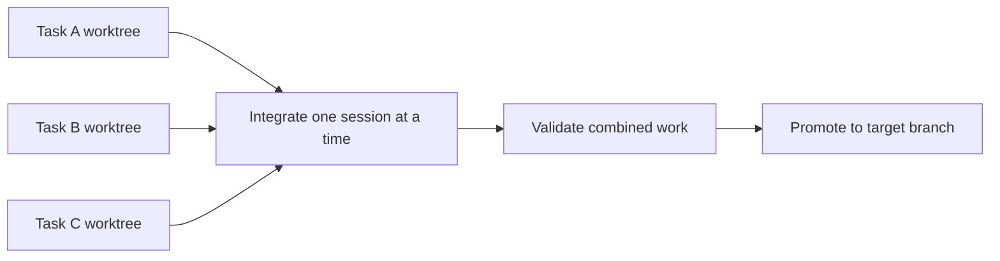

# sesh-integrator (`seshx`)

**Run coding agents in parallel. Automatically integrate their changes and resolve conflicts.**

[](https://github.com/byte-span/sesh-integrator/actions/workflows/ci.yml)
[](LICENSE)

`seshx` gives each task an isolated Git worktree, then integrates finished work
one session at a time. It merges the exact committed changes, runs your configured
checks, and promotes the result to your target branch.

Works with:

<table>
  <tr>
    <td align="center" width="180">
      <br />
      
      <br /><br />
      <strong>Codex</strong>
      <br /><br />
    </td>
    <td align="center" width="180">
      <br />
      
      <br /><br />
      <strong>Claude Code</strong>
      <br /><br />
    </td>
    <td align="center" width="180">
      <br />
      
      <br /><br />
      <strong>Antigravity</strong>
      <br /><br />
    </td>
    <td align="center" width="180">
      <br />
      
      <br /><br />
      <strong>Grok</strong>
      <br /><br />
    </td>
  </tr>
</table>

## Why use it?

Working in parallel is easy until several agents finish at once. `seshx` handles
the handoff between their worktrees and the branch you want to review:

- **Keep tasks separate.** Start isolated worktrees without moving, stashing,
  or committing unrelated edits in your launch checkout.
- **Integrate in order.** A per-repository lock serializes simultaneous finishes;
  each merge uses the exact recorded source commit.
- **Check before promotion.** Run configured validation against the combined work.
  Failed validation preserves the result for investigation and retry.
- **Recover with context.** Resolve conflicts in the current agent session, then
  resume using the preserved integration state.

Integration is a one-shot CLI operation. There is no background integration daemon.

## Quickstart

Requires **Node.js 20+**, **Git**, and a supported coding harness.
CI covers Linux and macOS; Windows is not currently verified.

### Install

Before npm publication, install from source with **pnpm 10.14.0**:

```bash
git clone https://github.com/byte-span/sesh-integrator.git
cd sesh-integrator
pnpm install --frozen-lockfile
pnpm build
./scripts/install-cli.sh
seshx setup
```

The source installer uses `~/.local/bin`; make sure it is on your `PATH`.
`setup` lets you select harnesses and previews the workflow skill and global
instruction files it will install. It preserves personal instructions outside
the managed block and leaves repository instructions untouched.

Once published, the npm package will include the built CLI:

```bash
npm install -g --foreground-scripts sesh-integrator
seshx setup
```

[Unattended setup, upgrades, and uninstall →](docs/installation.md)

Versioned packages are available from [GitHub Releases](https://github.com/byte-span/sesh-integrator/releases)
once published. Maintainers can [publish a release with one workflow run](docs/releases.md).

### Connect a repository

From the project you want agents to work on:

```bash
seshx register --auto-config
seshx doctor --installed
```

Auto-configuration detects setup commands and supported package validation scripts.
Review the reported checks and target branch before your first task. If checks
are unconfigured, add them in the runtime's `config.json` reported by `seshx status`.

The target defaults to the registered default branch unless a global or repository
setting overrides it. To keep `main` stable while agents integrate into `dev`,
[configure a development target](docs/configuration.md#stable-default-branch-with-a-development-target).

### Start a task

The installed workflow guides your agent through the lifecycle. These are the
same commands you can run explicitly:

```bash
seshx begin --create-worktree --harness codex --summary "Add search"
```

**Continue in the worktree printed by `begin`.** Make changes there, stage only
the intended files, then finish:

```bash
git add path/to/changed-file
seshx commit --message "Add search"
seshx validate
seshx integrate --summary "Added search and tests" --rollout none
```

Use your harness identifier: `codex`, `claude`, `antigravity`, or `grok`.
Start other independent tasks from the original checkout; each gets its own worktree.

`--rollout none` means no external setup is needed. For changes requiring manual
configuration or deployment, use `--rollout manual` with an explicit `--follow-up`.
[Rollout classifications →](docs/commands.md#integrate)

## How work comes together



The internal staging branch is separate from your target. Promotion verifies the
expected target commit and preserves dirty checkout state. A blocked promotion
stays recoverable instead of discarding edits.

Local integration is the default. Optional
[pull-request promotion](docs/configuration.md#optional-pull-request-promotion)
can push and open or update a PR after checks pass. It never merges the PR for you.

## Track progress and recover

```bash
seshx dashboard                     # Browse sessions and task checklists
seshx dashboard --web               # Open the local browser dashboard
seshx status --session <session-id>  # Inspect commits, state, and next steps
```

The dashboard shows saved session progress, current tasks, and recovery guidance.
It updates while open; it does not trigger background integration.

If a merge conflicts, the agent resolves and stages the files in the reported
integration worktree, then runs this **from its original source worktree**:

```bash
seshx resume
```

Failed validation or blocked target promotion also preserves recovery state.
Inspect the reported cause before retrying. Never delete locks or reset a
worktree to force progress. [Recovery details →](docs/commands.md#resume)

## Boundaries worth knowing

- **Local coordination.** JSON state and filesystem locks are designed for a
  personal machine, not distributed coordination across hosts.
- **Your checks define validation.** Registration alone does not prove a change
  is correct. Review and maintain the configured commands.
- **Worktrees are not a sandbox.** Repository code and configured commands run
  with your permissions. Only run code and configuration you trust.
- **Recovery may need judgment.** Ambiguous conflicts, interrupted sessions,
  and uncertain lock ownership may require manual review.
- **Worktrees are retained.** Cleanup is manual; preserve unfinished work and
  recovery data. Dependency checks stop until prerequisites succeed.
- **Harness behavior varies.** Automated tests use fake harnesses; real-provider
  smoke tests are opt-in. [Harness support and differences →](docs/harnesses.md)

## Documentation

| Looking for…                                           | Read                                    |
| ------------------------------------------------------ | --------------------------------------- |
| Setup, upgrades, uninstall, or a renamed installation  | [Installation](docs/installation.md)    |
| Validation, target branches, caching, or PR promotion  | [Configuration](docs/configuration.md)  |
| Every command, dashboard controls, or recovery details | [Command reference](docs/commands.md)   |
| Harness paths, settings, and adapter differences       | [Coding harnesses](docs/harnesses.md)   |
| Tests, benchmarks, signing, or maintainer safeguards   | [Development](docs/development.md)      |
| Moving from the old `codex-integrator` daemon          | [Legacy migration](LEGACY_MIGRATION.md) |
| Architecture and safety requirements                   | [Specification](SPEC.md)                |

### Developing sesh-integrator concurrently

When using this tool to develop itself, use an isolated source worktree and a
stable coordinator installed outside development checkouts. Pin its CLI path
for the entire session and target local `dev`.
[Full self-hosting workflow →](docs/development.md#developing-sesh-integrator-concurrently)

## Contributing

Bug reports and focused pull requests are welcome. See [CONTRIBUTING.md](CONTRIBUTING.md)
for setup, tests, and contribution guidance. Report vulnerabilities privately
using [SECURITY.md](SECURITY.md).

Licensed under [MIT](LICENSE).

<sub>`sesh-integrator`, `pintx`, `parallel-integrator`, and `codex-handoff` remain
supported CLI aliases. Existing runtime directories and recovery records are preserved.</sub>

## Execution capability checks

Use `seshx capabilities --recheck` in the agent or shell that will run the task.
`setup`, `doctor`, and lifecycle commands check disposable filesystem and Git
operations. Persist restricted operation with `seshx capabilities --mode manual`;
restore it explicitly with `--mode automatic` and recheck. Repository disablement
remains independent. See [execution readiness and recovery](docs/execution-capabilities.md)
for evidence limits, context changes, cleanup artifacts, and existing sessions.
